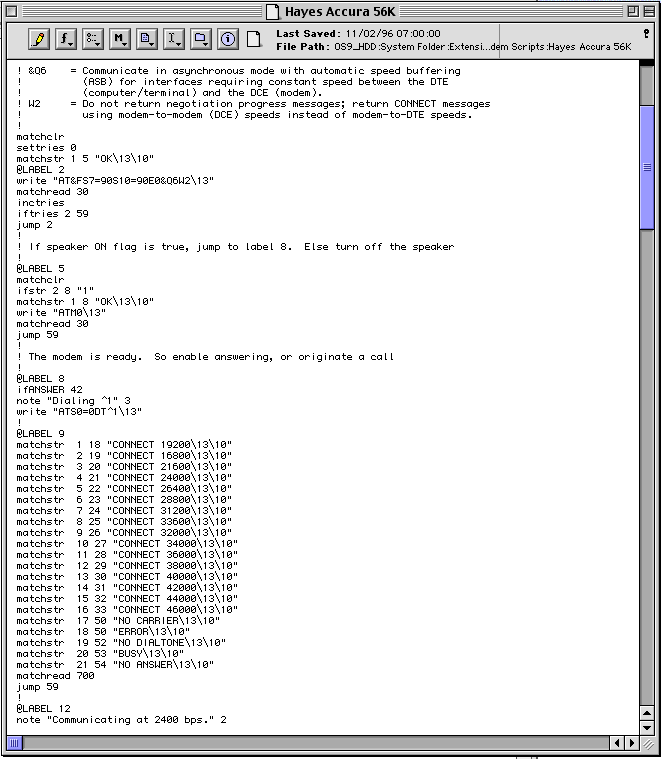
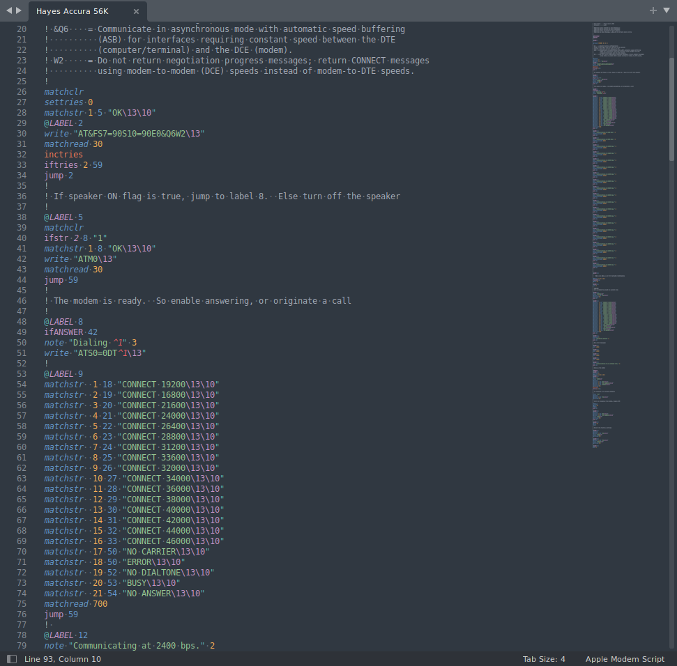
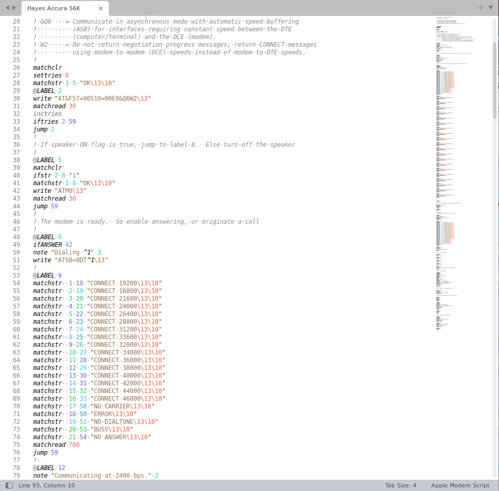
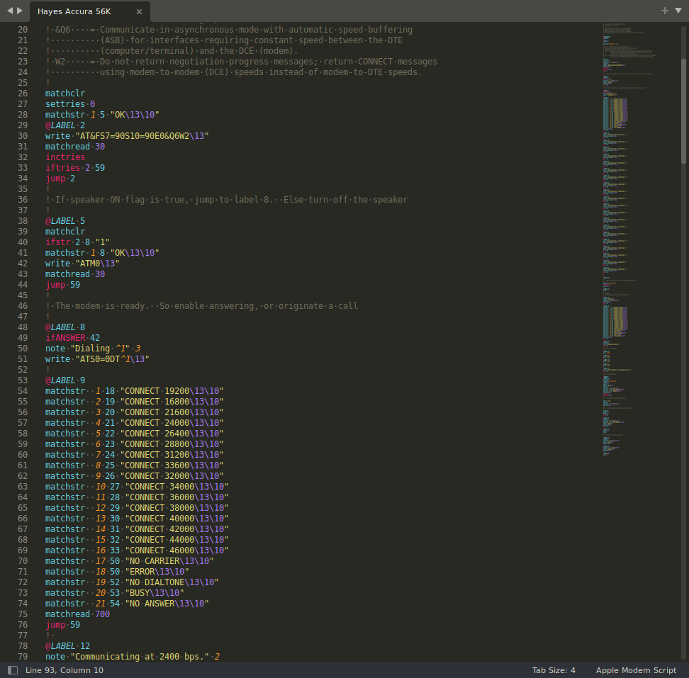

# AppleModemScript Syntax for SublimeText

Apple Remote Access modem script syntax plugin for Sublime Text.

## Overview

On the classic Mac OS, dialup modem drivers were really just script files. The scripting langage is
called Connection Control Language (CCL) and the files are used with Apple Remote Access. This
syntax plugin allows the creation and modification of these files much easier.

### On Mac OS 9



### On a modern computer



## Download

### Cloned from source

`git clone https://github.com/vbvr/AppleModemScript-sublime`

## Install

### Unix

```bash
cd AppleModemScript-sublime && \
mkdir ~/.config/sublime-text-3/Packages/AppleModemScript && \
cp AppleModemScript.sublime-syntax  ~/.config/sublime-text-3/Packages/AppleModemScript/
```

If you prefer this in your Installed Packages folder, do this:

```bash
cd AppleModemScript-sublime && \
zip -j AppleModemScript{,.sublime-syntax} && \
mv AppleModemScript.zip "~/.config/sublime-text-3/Installed Packages/AppleModemScript.sublime-package"
```

(Re)open Sublime Text.

### Windows

On Windows, copy `AppleModemScript-sublime\AppleModemScript.sublime-syntax` to
`%APPDATA%\Sublime Text 3\Packages\AppleModemScript\`  
(Re)open Sublime Text.

## Example Screenshots

   
  
   
 _See the resource link below for more information on getting the most out of Apple's CCL._

## Changelog

06/05/2022 - Initial release

## Contact

Check out my [profile](https://github.com/vbvr)!

## License

vbvr, Copyright 2022  
See [LICENSE](./LICENSE) for details.

## Resources

[Apple Remote Access Modem Scripting Guide: Version 2.1](https://web.archive.org/web/20030916190858/http://developer.apple.com/macos/opentransport/docs/dev/ARA_Modem_Scripting_Guide.pdf)
