# Connect other dial-up machines to your network and the internet with your Mac OS modem

Apple's Modem Scripts tell Mac OS how to get a dial-up modem to initialize, what to do when dialing
out and answering, how to tell the modem to maintain its ongoing connections. This 21st century guide
will show how you can edit a Modem Script, to answer incoming calls without landline phone service
(no dialtone).

## Purpose

Get any device equipped with a dial-up modem online again with the help of your classic Mac OS computer.

## Confirmed working with

Mac OS 9.2.1 as the remote access server  
Sega Dreamcast, Sega Saturn, Windows 98SE computer as calling clients

## Requirements

* Mac OS computer with a dial-up modem (Though this does work on Mac OS 9, this can also potentially
work with many of the older versions)
* Apple Remote Access
* Telephone (CAT3) cable
* 2nd machine with a dial-up modem

* Modem script to edit
* Text editor (SublimeText, BBEdit, SimpleText, etc.)

### Optional but useful

* Apple Modem Scripting Guide

For the purposes of this guide, the stock Apple Internal 56K Modem in a PowerMac Sawtooth and Mac OS
9.2 are used, with BBEdit and Sublime Text as example editors.

## Computer Preparation

Verify that your Mac can go online the present-day way, first. Apple System Profiler and Control
Panels -> TCP/IP show if you have an IP address from your network. You can next try loading
[http://macos9lives.com](http://macos9lives.com) or another *unsecured* website from your web
browser. Verify that your modem itself is installed and recognized by Mac OS 9. You can either check
your Extensions folder or you can check Apple System Profiler.  
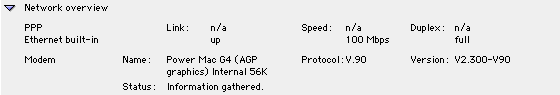  
  
If the script for your modem is missing in the Extensions folder, you can check the CD Extras folder
of your Mac OS installation media, for the Additional Modem Scripts installer. You can also try
using Apple's Modem Script Generator, as another option.  
If you do not see any modem listed at all within Apple System Profiler or the TCP/IP Control Panel,
then you will have more figuring out to do before continuing.

## Script Preparation

* For editing from within Mac OS:

  * Go to `:Macintosh HD:System Folder:Extensions:Modem Scripts` and duplicate the script you want to
  edit into another folder.
  * Open the duplicate file in your text editor. Since Mac OS sees the file as a modem script, you
  might need to do this through `File -> Open` and set Show to `Any file`  
  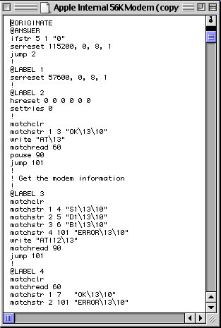

* For editing from a modern OS with access to a netatalk server:

  * Go to `:Macintosh HD:System Folder:Extensions:Modem Scripts` and duplicate the script you want to
  edit into your netatalk server.
  * Launch Sublime Text and open the modem script *without moving it off the server*. This will retain
  the file creator and type information.  
  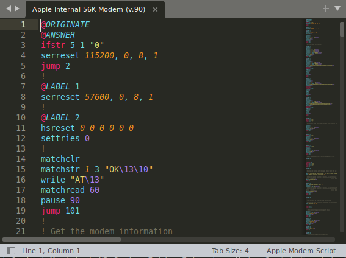
* In the file, look for the message `"ATA\13"` (the modem command to pick up the phone is `ATA`).
* Take note of the `@LABEL` value just above it. For me it was 88.
* Look for `@ANSWER`. This is usually at the top, where the modem first gets initialized. Skip down
  to the first `ifANSWER` after this area of the script. Switch the `ifANSWER` value to the value you
  noted.  
  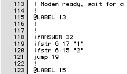 ---> 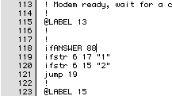  
  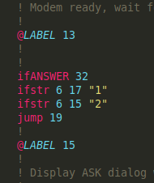 ---> 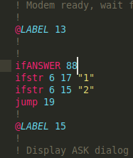
* Save the file and close your text editor.  
* Add your new modem script to `:Macintosh HD:System Folder:Extensions:Modem Scripts`.

*Though untested, the netatalk method might also work with modern AppleShare servers on macOS.*

## Remote Access Preparation

* Launch `Control Panels -> Modem`
  * Choose the new modem script you just made.
  * (optional) Sound can be set to Off if you do not want to hear that familiar 90's sound during connections.
  * Dialing can stay set to Tone.
  * (optional) Check or uncheck Ignore Dial Tone.  
  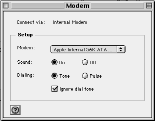

* Launch `Control Panels -> File Sharing`
  * Go to Users & Groups tab
  * Click Open for owner (or click New User)
    * For Identity, set a name and password
    * (optional) For Sharing, check the boxes for "Allow user to connect to this computer", "Allow
    user to see all disks" and/or "Allow user to link to programs"
    * For Remote Access, check the box for "Allow user to dial in to this computer".

* Launch `Control Panels -> Remote Access`
  * *The main Remote Access window can be ignored.*
  * Open `RemoteAccess -> Answering...`
  * Select *Answer calls*, *Allow access to entire network*, and *Allow TCP/IP clients to connect
  using PPP*
  * (optional) Set the Maximum Connection Time, the default IP address, and/or allow the calling
  machine's software to set their own IP address. Whether the latter two will work are totally
  dependent on your network's routing rules and the calling machine's TCP/IP options.  
  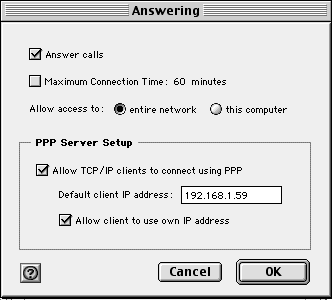  
**Important: Do not click OK yet**

## Caller Preparation

Finally, get your calling machine set up.

* Connect the telephone cable between your Mac and the calling device.
* Open the calling machine's connection settings.
  * The phone number can be anything, as long or as short as you would like.
  * Include the username and password you made from File Sharing's Users & Groups tab.
  * **Blind dial/Ignore dial tone must be enabled**
  * All other settings should be optional or machine-specific.

## Answer the call

### Timing counts here

1. Have the calling machine dial to connect.
2. On your Mac, click OK in `Answering`
3. Listen to the modem sounds and/or watch the Statuses between your Mac and the calling device.
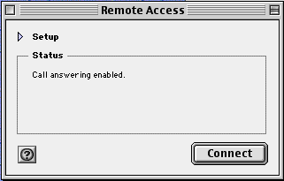
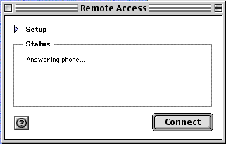
4. If the connection was successful, you will see Connected at 33600bps or lower (this value can be
different based on the calling modem's speed and any noise getting into the telephone line).  
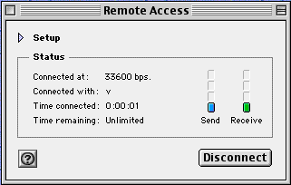  
*(optional) `RemoteAccess -> Avtivity` log (⌘+L) can show logs of what's happening during the call
session.*

## Hang up

***Important***
Once the calling device has disconnected, go back to `RemoteAccess -> Answering...`, uncheck
`Answer calls`, then click OK. If you do not do this, the modem script will loop, your modem pick up
again for nobody and make a very noticeable, unexplainable, steady sound again and again, until
answering is disabled.

## Connect again

There's much less to do now:

* Launch `Control Panels -> Remote Access`.
* Open `RemoteAccess -> Answering...`.
* Select *Answer calls*.
* *Do not click OK* and do the 4 steps of [Answer the call](#answer-the-call).

## Troubleshooting Tips

* If the calling machine does not find a connection, uncheck "Answer calls" in `Answering` first, then
try the following:
  * Do steps 1 and 2 in reverse.
  * Add a battery to the phone line, to [simulate POTS current](https://www.jagshouse.com/modem.html).
* If your new modem script loses its file descriptions along the way, use your favorite creator/type
utility and set the script with creator code to `slnk` and the type to `mlts`.

## Resources

Apple Remote Access 3.0 Users Guide  
[Apple Remote Access Modem Scripting Guide: Version 2.1](https://web.archive.org/web/20030916190858/http://developer.apple.com/macos/opentransport/docs/dev/ARA_Modem_Scripting_Guide.pdf)  
[Jagshouse's modem page](https://www.jagshouse.com/modem.html)
